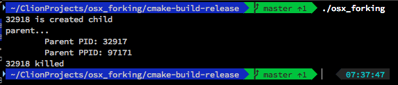

## OSX_forking

Example code showing use of Linux / Unix API's on OS X
Also built commandline program

### USAGE:

Download the release and unzip. Inside the **cmake-build-release/** folder is an already built executable, *osx_forking*. 

Simply open a terminal into that directory and enter:
  ```bash
  $ ./osx_forking
  ```
  
### EXAMPLE OUTPUT:



